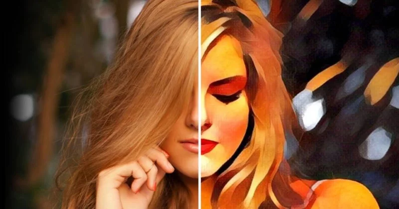
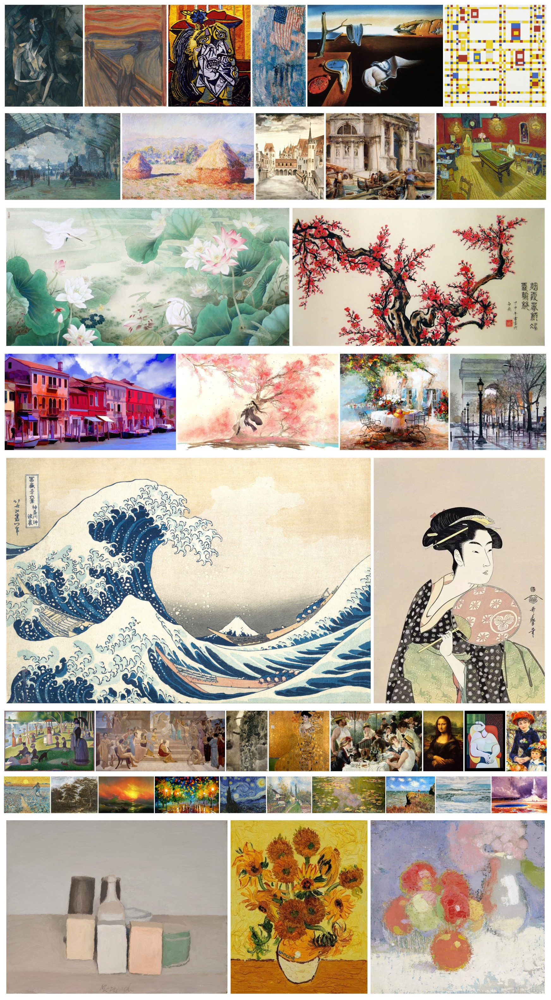
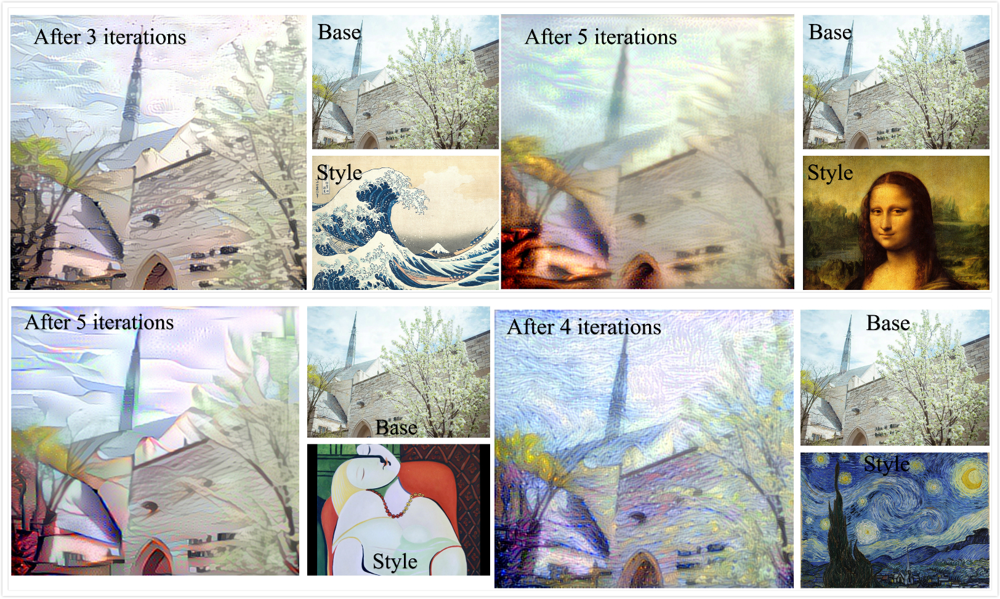

## Abstract

### Motivation
We want to use machine learning programs to transfer daily pictures to artistic style images by using a style image for obtaining the transferred style and a content image which we want to transfer the style onto. This project can demonstrate how well machine learning techniques perform on image processing and how artificial intelligence can, to some extent, achieve considerable success in the field of art and creativity.

   
  <i>Prisma style transfer image</i>

  

Current style tranfer technques such as Prisma emphasized more on the color and layouts of style image. Hence, the synchronized image might lose the color and distort the outline of the content image. In our project, we would like to explore a technique that could keep the features of content images as well as apply artistic styles from style images.   

### Approach
We used convolutional neural network, specifically [*VGG19 model* in *Keras* library](https://keras.io/applications/#vgg19) in *Python*, for the implementation. The data set we used for this project consists of two sets of images: style images and content images. We have selected 40 famous paintings as style images. To transfer artistic style from paintings to content images, we include 4 images for testing: two of them are sceneries and the other two are portraits. 

### Result
In summary, we found that convolutional neural network performed very well on this task due to its outstanding performance on analyzing visual imagery. We have acquired decent synthesized images using CNN model with tuned parameters.  

   
  <i>Figure 1: Kanagawa Waved Deering</i>

  

   
  <i>Figure 2: Le Rêve Robert Downey Jr.</i>

     

Since CNN utilized Max Pooling as downsampling strategy, when the image contains large contrastive color blocks in different areas, CNN will perform the best. In our examples, when the style image has big blocks of colors such as *Le Rêve* by *Picasso* in Figure 2, we observed the most decent results. On the contrary, if the style image is too colorful with small blocks of various colors as in Figure 3, the synthesized image will contain messy strokes and the layout of the colors will be chaotic.   

   
  <i>Figure 3: Fragmented Deering</i>

     

According to our observation, we recommend selecting style images with simple outlines and big blocks of colorful blushes for artistic style transfer and avoiding using paintings with many small blocks of colors such as *Broadway Boogie-Woogie* by *Piet Mondrian* in Figure 3.

### Contact Us
Haishan Gao -   B.S in Computer Science   - haishangao2020@u.northwestern.edu     
Jiajia Luo  - B.S in Computer Engineering - jiajialuo2018@u.northwestern.edu     

## Project Introduction

### Methodology
We use the pre-trained [*VGG19*](https://keras.io/applications/#vgg19) convolutional neural network model from Keras library in Python for our implementation due to its stability and reliability. The model requires a style image and a content image as inputs, and a noise image for optimization. During the optimization process, the code runs *scipy*-based optimization (L-BFGS) over the pixels of the generated image to minimize a loss value calculated by weighting content and style losses (the representation of "loss value" is introduced in the next section). Finally, the noise image will be optimized into a synchronized image which has content of the content image and a similar style from the style image.   
You can refer to the source code [here](Final_project_Style_transfer.ipynb).

### Feature Representation
The style or content representation of an image is measured by the output of a specific layer of the neural network. We have iterated through several layers to find the optimal one for output. 
In order to measure the similarity of the style/content of two images, we further define values “style loss” and “content loss” between the processed image and the input images, with less “loss” meaning the images more similar in style and content, respectively. Content loss is measured by passing both the synthesized image and the content image through some layers of the model and finding the Euclidean distance between the intermediate representations of those images; while style loss is measured similarly by comparing instead the **Gram matrices** of the outputs at various layers. (*A Gram matrix results from multiplying a matrix with the transpose of itself and contains non-localized information about the image, such as texture, shapes, and weights - which we defined as “style” representation in
our case.*)

### Data Collection
The data set consists of two types of images: style image and content image. We collected approximately one hundred representative paintings and selected 40 of them as the style image data set for our project. We then assigned them into 8 different categories: abstract art, Chinese paitings, Japanese Ukiyo-e, portraits, still, sceneries, buildings and illustrations. For content images, we include two portraits and two sceneries since we observed that the results might differ when we used different images as content image.
We applied 40 style images for each content image and we ran 5 iterations of optimization for each pair. Hence, we obtained 800 photos in total in out final data set.   
*We include all 800 synthesized photos [here](https://drive.google.com/drive/folders/1GbMVbA7TIFv0AkmXngNmnOR_7chdFqfC?usp=sharing).*

   
  <i>Figure 4: Style Image Data Set</i>

 

   
  <i>Figure 5: Content Image Data Set</i>

### Evaluation

We include both quantitive and qualitative evaluations for the results returned by the model. For qualitative evaluation, we simply evaluate the synthesized images manually. For quantitive evaluation, we use the specific weighted loss values returned after each iteration of optimization.   
When we are evaluating the synthesized images manually, we find that as the iterations of optimization proceed, the noise image is more similar with the style image (i.e. the synthesized image contains more features in the style image such as colors, patterns and strokes) as shown in Figure 6. Hence, in the first iteration of optimization, the synthesized image is most similar with the content image. 

   
  <i>Figure 6: Five iterations for each style-content pair</i>

   

After we gave ratings to all 800 images, we tried to find correlations between manual ratings of the images and their loss values statistically. However, it is disappointing that a conclusion can be made that there is no correlation between them. In our points of views, a primary reason is that human evaluations are very subjective especially when the differences between the images are trivial. However, when two synthesized images use the same content image and their final loss values (after 5 iterations) differ a lot with different orders of magnitude, they might still look similar and it is not possible for us to give an exact conclusion on which one is better.     
Another interesting point is that we find in most cases we consider the image in the first iteration (which looks most like the content image) as the most artistically good-looking among all five, especially when all five iterations of images are not ideal. Following are some points we summarized after the evaluation process:   
- In the cases when we give the first two iterations highest ratings, the trained image is more like the content image and the later iterations might produce images that contain messy textures as in Figure 3. The first iteration produces an image that keeps most features of the content image and very basic features such as colors of the style image.
- In the cases when we give the third or fourth iterations highest ratings, the patterns and the strokes of the style images can be shown clearly in the synthesized image.
- In the cases when we give the last iteration highest ratings, the style images are often abstract or impressionism and the synthesized image in the fifth iteration is blurred in a way that we think is artistically beautiful.
- We found that when we use portrait paintings as style images to train portraits, we can get decent results in most cases and their loss values are mostly in the same order of magnitude. We are not sure why this case happens and what it infers.

### Findings
We summarized some findings after analyzing all synthesized images we obtained.

**Portraits**
 - When we use portraits as content images, we found that a key feature of decent synthesized images is that they have seperated the human face and the background. Hence, for portraits, we expect the style images we use can seperate and assign different objects different features after training, and we observed that paintings with large blocks of colors and clear outlines can achieve this effect.   
 - For human faces, if some facial defects such as wrinkles and under-eye dark circles are removed in the synthesized image, we often consider such result as decent. Hence, future works can focus on searching for style images that can have such effects for style transfer for portraits.   
  

   

    

 - Random small blocks of colors are accpetable or even artistically beautiful in style-transfered sceneries. However, if the color blocks appears on human faces, it will not seem good or even horrific.   
 

   

    

**Sceneries**
- On the contrast to portraits, when we use sceneries as content images, most paintings can achieve decent results, especially when the main colors of the scenery photo are light.
- For sceneries, we give higher iterations better ratings since we observe that applying more features to the sceneries can receive interesting images that we think are artistically beautiful.
 

   

  

### Results
In summary, our implementation using CNN model can successfully realize artistic style transfer. The novelty of the project is that we explore how to implement style transfer when the content image is the emphasis of the synthesized image. We also summarized some patterns after we evaluated all 800 synthesized images.    

   

  

   

  

### Future Works
Future works can focus on object segmentations for better performance, especially for portraits. According to our observations, abstract paintings with clear outlines and impressionism art can often perform well as style images for portraits. Further testing and research should be done to testify this observation point. 
Other CNN models such as VGG16 can be used for implementation to explore better models for this topic. 

### References
1. A Neural Algorithm of Artistic Style by Gatys, Ecker and Bethge (2015).
2. Jiajia is responsible for model training while Haishan is responsible for data acquisition and project website design.
